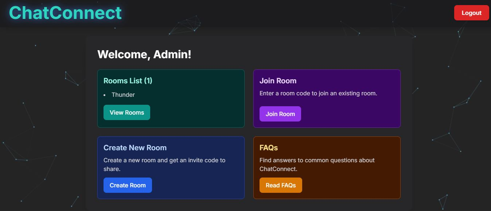

# 🚀 ChatConnect - Real-Time React & Firebase Chat App

A modern real-time chat application built with React and Firebase, featuring secure authentication and an invite-code system for private conversations.



---

## ✨ Features

### 🔐 Secure Authentication
- Username/Password signup and login.
- Secure profile creation.
- Password reset functionality.

### 💬 Real-time Communication
- Instant messaging powered by Firebase Firestore's real-time listeners.
- Live updates for room status and user presence.

### 🏠 Room Management
- Create private, single-user "lobby" rooms.
- Generate a unique, single-use invite code to share.
- Securely join rooms using an invite code.
- Delete rooms after a conversation is over.

---

## 🛠️ Tech Stack
- **Frontend:** React, Vite, JavaScript, TailwindCSS
- **Backend, Auth & Database:** Firebase (Authentication & Cloud Firestore)
- **Deployment:** Vercel

---

## 🚀 Getting Started

Follow these instructions to get a copy of the project up and running on your local machine for development and testing.

### Prerequisites
- Node.js (v18.x or later)
- npm

### Installation
1. Clone the repository:

```bash
git clone https://github.com/AryanKo/secure-chat.git

2. Navigate to the project directory:

```bash
cd secure-chat

3. Install NPM packages:

```bash
npm install

4. Set up environment variables:
Create a .env.local file in the root directory and add your Firebase project configuration keys:

```bash
VITE_FIREBASE_API_KEY="YOUR_API_KEY"
VITE_FIREBASE_AUTH_DOMAIN="YOUR_AUTH_DOMAIN"
VITE_FIREBASE_PROJECT_ID="YOUR_PROJECT_ID"
VITE_FIREBASE_STORAGE_BUCKET="YOUR_STORAGE_BUCKET"
VITE_FIREBASE_MESSAGING_SENDER_ID="YOUR_MESSAGING_SENDER_ID"
VITE_FIREBASE_APP_ID="YOUR_APP_ID"
VITE_FIREBASE_MEASUREMENT_ID="YOUR_MEASUREMENT_ID"

5. Run the development server:

```bash
npm run dev

The application will be available at http://localhost:5173 (or the next available port).
